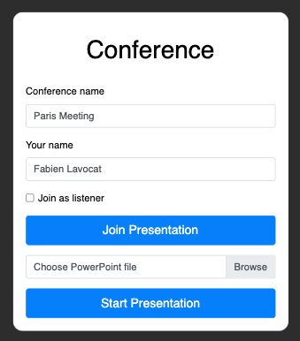
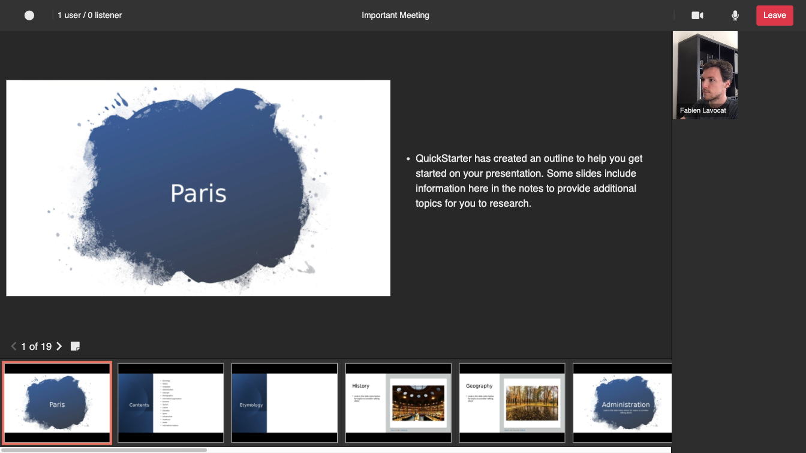
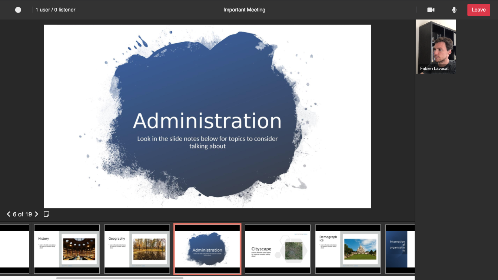
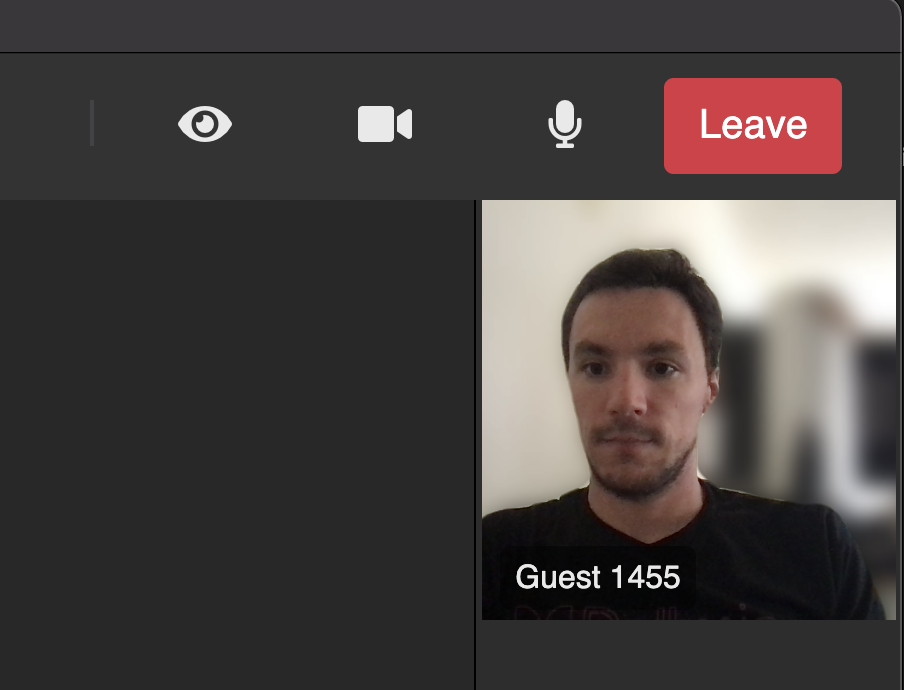

# :warning: This repository is no longer maintained :warning:

[](https://github.com/dolbyio-samples/dolbyio-web-file-presentation-service/actions/workflows/deploy-to-gh-pages.yml)
[](LICENSE)

# Dolby.io - File Presentation Service

This GitHub repo is a sample application that uses the [File Presentation Service](https://docs.dolby.io/communications-apis/docs/js-client-sdk-filepresentationservice). It is using [React.JS](https://reactjs.org) as front end technology and [Node.JS](https://nodejs.org) as backend server.

## Introduction

This sample application allows you to start a webinar type of presentation when participants can upload a PowerPoint file and start a presentation. Then other people can join the presentation as participants or listeners.



When you host a presentation, only you can control the slides. You have the possibility to navigate between the slides using the left and right arrow bellow the presentation slide, or directly by clicking on the slide thumbnail in the list of slides at the bottom of the screen.



You can display the notes from each slides.



Or not display them. The video can be rectangular.


Or a circle. All of this is configurable using React properties.


When you join as a participant, you can only see the current presentation slide and share your video and microphone. While connected as a listener, you can only see the current presentation slide but not share your camera and microphone.

## Where to start

Clone this repo:

```bash
git clone https://github.com/dolbyio-samples/dolbyio-web-file-presentation-service
```

In the folder you've created, run the following command to install all the package dependencies:

```bash
npm install
```

If you haven't done so already, create an account on [dolby.io](https://dolby.io/signup), it is free so do it today! Go to your dashboard and for the first application, get your `App Key` and `App Secret`.

Create a `.env` file at the root of this folder and insert your consumer key and secret like that:

```
APP_KEY=<Your app key>
APP_SECRET=<Your app secret>
LIVE_RECORDING=false
```

Compile the React.JS application with the command:

```bash
npm run build
```

Start the Node.JS server with this command:

```bash
npm run start
```

## Desktop Application

This project is now providing you with a way to build automatically a desktop application using the same code base as the web application and the electron framework.

Open the file `./desktop.js` and change the `serverUrl` to match the address of your server. You do not need to change this when testing this application locally.

Build and run the desktop application with the command:

```bash
npm run desktop
```



## Mixer Layout Application

This project automatically builds a custom Mixer Layout Application that you can use in your own projects. After you build the application, in the folder `dist_mixer`, you will find the two files you need to host for the mixer layout application. You can also directly use the one from this version of the repo by pointing the _Recording Mixer Layout URL_ setting from the Dolby.io dashboard to this URL:

```
https://dolbyio-samples.github.io/dolbyio-web-file-presentation-service/index.html
```

## Docker Image

You can build your own Docker image with this project using the command:

```bash
docker build -t fps .
```

To run the container, you must provide the two environment variables `APP_KEY` and `APP_SECRET`. And you can map the port 8081 of the container to your local port 80.
```bash
docker run --rm -it -p 80:8081/tcp --env "APP_KEY=<value>" --env "APP_SECRET=<value>" fps:latest
```

Now you should be able to access the application from this page: http://localhost

## Features

Here is the list of what you can do in this application:

-   Upload a PowerPoint presentation
-   Join as participant, guest or listener
-   Navigate through the slides
-   Extract the notes from the slides
-   Display or not the notes dynamically
-   3 different video layouts (Round, Vertical, Horizontal)
-   Record the conference
-   Use [Enhanced Conference Access Control](https://docs.dolby.io/communications-apis/docs/guides-enhanced-conference-access-control) with the permissions set on the server side
-   Mixer layout
-   Docker image to run the application easily
-   Use Electron to generate a native desktop application
-   Video background blur

## Open Source Projects

This sample application is using the following Open Source projects:

-   [@dolbyio/dolbyio-rest-apis-client](https://www.npmjs.com/package/@dolbyio/dolbyio-rest-apis-client)
-   [FontAwesome](https://fontawesome.com)
-   [Bootstrap](https://getbootstrap.com)
-   [Google Fonts](https://fonts.google.com)
-   [is-electron](https://www.npmjs.com/package/is-electron)
-   [JQuery](https://jquery.com)
-   [JSZip](https://stuk.github.io/jszip/)
